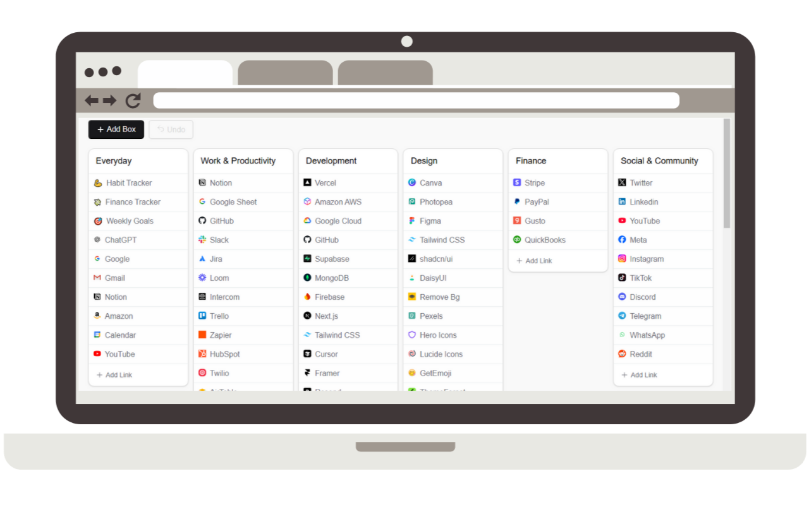

# QuickLinks New Tab

Organize your web links like never before with **QuickLinks New Tab**!

This extension is designed to streamline your online browsing experience by allowing you to organize, personalize, and access all your favorite links in one place.

Instead of the default Chrome new tab page, see a fully customizable layout of links that saves time and boosts productivity.

Create multiple boxes, add links with custom emojis or website favicons, and effortlessly arrange everything to suit your needs.

## Key Features

### New Tab Link Dashboard
Every time you open a new tab, your saved links are displayed, allowing quick and easy access. Say goodbye to a blank new tab screen, and hello to a space optimized for your needs.

### Multi-boxes Layout
Easily organize links into separate boxes, allowing you to categorize links by project, topic, or personal preference. You can add, remove, and rearrange boxes anytime, keeping everything tidy and accessible.

### Customizable Link Icons
Each link can be represented with an emoji or the website favicon, so you can visually recognize links at a glance. The extension fetches favicons automatically, but you can always choose your preferred representation.

### Drag-and-Drop Functionality
Easily reorder links within a box or move them between boxes. You can even drag entire boxes to customize your layout.

### Quick Access Modal
Use the "Add Link" button to quickly add a new link. A simple modal allows you to input the URL, title, and select an emoji or favicon to represent the link. The interface is intuitive, making it quick and easy to expand your list of favorites.

### Undo Feature
Made a mistake? The undo feature allows you to revert recent actions, helping you avoid accidental deletions or reorganizations.

### Easy Setup and Preloaded Links
The first time the extension loads, a preselected list of useful links is provided to get started quickly. Customize this initial setup to make it your own.

## Why You’ll Love It

### Productivity Enthusiasts
Organize links for work projects, online research, learning resources, and more. Keep everything neatly sorted and accessible without opening numerous tabs.

### Curators and Collectors
Create thematic collections of links based on your interests or hobbies. Quickly access your go-to resources and never lose track of a link again.

### Efficiency Seekers
With the customizable icon feature, recognize your most-used links at a glance, saving time and reducing clutter.

### User-Friendly Design
The interface is intuitive and built for ease of use. Drag-and-drop sorting, simple controls, and an organized layout help you keep all your favorite links at your fingertips.

### Privacy and Data Security
Your data is stored locally within your Chrome Local Storage, ensuring that your information remains private and secure.

## Installation

1. Go to the [Chrome Web Store](https://chromewebstore.google.com/detail/quicklinks-new-tab/ckjpbndlchpnfkpgnlahcfbbmdmgieip).
2. Click **Add to Chrome** and confirm the installation.
3. Open a new tab and start organizing your links!

## License

This project is licensed under the [MIT License](LICENSE).

---
Install now to transform your new tab page into a dynamic, useful link dashboard that saves time and keeps you organized every time you open a new tab!

